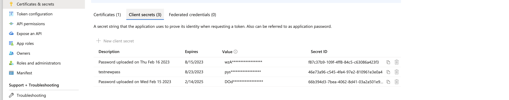

## Continuous Security by Code Signing the Artifact Files and Docker Images before Deployment by using Azure Devops , Azure key vault ,self signed certificates and also AWS Devops, Code_Signing,Dockerimages,SigStore Cosign

## Part 1
## AWS Code Signing


## Docker Image Signing using Sigstore Cosign and AWS Codepipeline

## What to Expect

- Learn in detail about cosign 
- Learn how to sign images with cosign , AWS KMS , AWS Codepipeline 
- Learn how to provision entire proejcts resources using terraform templates

## Overview 

With container images, ensuring that the container running is the container you intended to run is imperative. If an image is replaced with a modified image, your systems may run an attacker’s code which can include Command and Control systems, Phone Home applications, or even reverse shells

While this can help increase the security of the storing images by keeping images inside your control boundary and allowing stricter access control, access from private networks only, etc. It does nothing to protect the images if an attacker were to get write permissions to your registry. If an attacker gained write access to your private registry, the images could still be replaced with a modified image and your systems would never know. This is where image signing can be used to ensure the images have not been modified.

Cosign has support for leveraging signing keys stored in different services and security modules.


## Pre requisites
1. Make sure that terraform and aws cli is installed 
2. Make sure that the aws cli is configure with correct access key and secret key
3. Have knowledge on how terraform templates work


## Required Resources
Terraform creates all the AWS Resources necessary to run the Codepipeline.

* Codepipeline
    - S3 Bucket
    - IAM Role
    - IAM Role Policy
* AWS Codecommit Repo
* CodeBuild Project
    - IAM Role
    - S3 Bucket
    - Cloudwatch Log Group and Steam
* ECR : Container Repository
* KMS : Asymmetric key used for cosign key signing


## Automate Signing of Docker Images using cosing and AWS Codepipeline

### Create Code Pipeline 

Here we are making use of terraform templates in order to provision our resources on the AWS console , thus we will be using the below terraform scripts in order to provision the Source and Build phases of the Code Pipeline.

```

stage {
name = "Source"

    action {
      name     = "Source"
      category = "Source"
      owner    = "AWS"
      provider = "CodeCommit"
      version  = "1"
      output_artifacts = [
      "source_output"]

      configuration = {
        BranchName = aws_codecommit_repository.devsecops.default_branch
        RepositoryName = aws_codecommit_repository.devsecops.repository_name
      }
    }
}
```

Our next step is to use the CodeBuild provider to build the container and sign it.
```
stage {
  name = "Build"

  action {
    name     = "Build"
    category = "Build"
    owner    = "AWS"
    provider = "CodeBuild"
    input_artifacts = [
    "source_output"]
    version = "1"

    configuration = {
      ProjectName = "${var.name}-codebuild-BUILD"
    }
  }
}
```

### Create CodeBuild 
CodeBuild uses containers for working environments. This is defined in the environment section of the
CodeBuild project.

NOTE : make sure to use aws/codebuild/amazonlinux2-x86_64-standard:4.0 image as it is only compliant with the go version that we use to install cosign


```
environment {
    compute_type                = "BUILD_GENERAL1_LARGE"
    image                       = "aws/codebuild/amazonlinux2-x86_64-standard:4.0"
    type                        = "LINUX_CONTAINER"
    image_pull_credentials_type = "CODEBUILD"
    privileged_mode             = "true"

    environment_variable {
      name  = "ACCOUNT_ID"
      value = data.aws_caller_identity.current.account_id
      type  = "PLAINTEXT"
    }

    environment_variable {
      name  = "COSIGN_ROLE_NAME"
      value = aws_iam_role.codebuild.name
    }
  }
```
CodeBuild is set up using a Build spec, which is a yaml file that runs commands defined in stages. The Buildspec yaml has four phases, install, pre_build, build and post_build.


```
source {
     type      = "CODEPIPELINE"
     buildspec = file("${path.module}/../buildspec.yml")
 }
```

### Generate KMS Key

AWS Key Management Service (AWS KMS) is a Key Management service that provides a secure and resilient hardware security module used to store cryptographic keys securely in a cloud environment. AWS does not allow the export of private keys created in KMS which provides a safeguard against having the key stolen. This also means you must have active credentials with AWS at the time of signing.

Cosign supports the AWS Key Management System to store the private key for signing containers. As with the other AWS resources, terraform generates the KMS key to be used later in the cosign CodeBuild post_build phase.

```
resource "aws_kms_key" "cosign" {
  description             = "Cosign Key"
  deletion_window_in_days = 10
  tags = {
    env = var.name
  }
  key_usage = "SIGN_VERIFY"
  customer_master_key_spec = "RSA_4096"
}

resource "aws_kms_alias" "cosign" {
  name          = "alias/${var.name}"
  target_key_id = aws_kms_key.cosign.key_id
}
```

We can create kms key by aws cli but we have used terraform templates to create the same
can be created using the below command as well
```
$ aws kms create-key --key-usage SIGN_VERIFY --customer-master-key-spec RSA_4096 --description "KMS key for signing images"

```
or similar terraform template as below

```
# key rotation is only supported for ENCRYPT_DECRYPT
resource "aws_kms_key" "cosign_signing_key" {
  description              = "KMS key for signing images"
  key_usage                = "SIGN_VERIFY"
  deletion_window_in_days  = 30
  enable_key_rotation      = false
  customer_master_key_spec = "RSA_4096"
}
resource "aws_kms_alias" "cosign_signing_key_alias" {
  name          = "alias/cosign-key"
  target_key_id = aws_kms_key.cosign_signing_key.key_id
}
```

## Install Cosign

We will need to be installoing Cosign tool as a CodeBuild Provider for a Signing action.This will generate the signed container and  store it in the AWS ECR repository.  CodeBuild comes with various containers to use and the phases allow us to customize the environment to meet our needs.

Install cosing through go command 
```
go install github.com/sigstore/cosign/v2/cmd/cosign@latest
```

We can see this phase in action in the above screenshot of CodeBuild Console.

The pre-build stage allows us one final phase before we build the container. As with docker hub, we need credentials to the AWS ECR repository

```
pre_build:
    commands:
      - make ecr_auth
```

Now that we have the credentials to ECR we can build the container.

CODEBUILD_RESOLVED_SOURCE_VERSION is a prebuilt CodeBuild environment variable that will produce the sha of the commit that kicked off the pipeline.

``` 
build:
  commands:
    - make docker_build VERSION=$CODEBUILD_RESOLVED_SOURCE_VERSION`
```
When the container is built we can push it to the ECR registry and then sign and verify it.


### CodeBuild Signing Containers
In the post build phase, we push the container to the AWS ECR registry. Then sign the container with the kms key and for good measure verify that it was signed.

Here are the Makefile targets, so you can see the full cosign commands. Cosign supports using aliases instead of having to gather the KMS id.

```
key_gen:
  cosign generate-key-pair --kms awskms:///alias/$(NAME) $(ACCOUNT_ID).dkr.ecr.$(AWS_REGION).amazonaws.com/$(IMAGE):$(VERSION)

sign:
  cosign sign --key awskms:///alias/$(NAME) $(ACCOUNT_ID).dkr.ecr.$(AWS_REGION).amazonaws.com/$(IMAGE):$(VERSION)


verify: key_gen
  cosign verify --key cosign.pub $(ACCOUNT_ID).dkr.ecr.$(AWS_REGION).amazonaws.com/$(IMAGE):$(VERSION)

```

  Below we can see the final phase of the CodeBuild run signing and verifying the container.


Here is the view of the AWS ECR console with the signature and the container images. 


Note: Here I have added the commands through a Makefile and can be executed with "make EXAMPLE" command.

## AWS Buildspec Yaml
```
---
version: 0.2

phases:

  install:
    runtime-versions:
      golang: 1.18
    commands:
      - yum update -y --skip-broken
      - yum -y install curl jq python3-pip python3-dev perl-Digest-SHA --skip-broken
      - pip3 install --upgrade awscli
      - export PATH=$PWD/:$PATH
      - sudo rm -rf /usr/local/go
      - wget https://go.dev/dl/go1.19.5.linux-amd64.tar.gz
      - sudo tar -C /usr/local -xvzf go1.19.5.linux-amd64.tar.gz
      - export PATH=/usr/local/go/bin:$PATH
      - go help
      - go version
      - go install github.com/sigstore/cosign/cmd/cosign@latest

  pre_build:
    commands:
      - make ecr_auth
  build:
    commands:
      - make docker_build

  post_build:
    commands:
      - make docker_push
      - make sign
      - make verify
artifacts:
  files: build.json


```


## How to Run the Project

Step 1: Clone the github repository [repo](https://github.kyndryl.net/DevSecOps/AWS-Code-Signing.git)

Step 2: Create an S3 bucket for Terraform remote state storage, this will have to be unique.
```
aws s3 mb s3://cosign-aws-codepipeline
```

Step 3: Initialize Terraform
```
make tf_init
```

Step 4: Create the Terraform plan
```
make tf_plan
```

Step 5: Apply the changes
```
make tf_apply
```

Step 6: Push this code repo to the AWS Codecommit repo


All these Steps will initiate the codepipeline and codebuild pipelines and it will be created by the terraform t


## Part 2

# Azure Code Signing

Part 2.1
### Docker Images:  Azure Code Signing - Docker Images

### What to expect 
- Learn how to sign docker images using sigstore cosign
- Learn how to use secrets and self signed certificated from Azure key vault
- Learn how to create Service principals in Azure 

### Overview 
In today’s world, all the applications or software utilized by users are virtualized and downloaded from a docker container. One fear many users have is that it might be possible that attackers tampered with the file that users are downloading from the container and have injected a malicious script or malware in it. If this is the case, whenever any person downloads and executes it in their system, the system gets affected by the attacker’s malicious script. Hence we will be needing docker image signing . Docker image signing is the process of digitally signing docker images to confirm the software author’s identity and provide assurance that the code has not been altered or compromised.

### Pre requisites
1. Azure devops and azure portal access
2. An Azure ACR docker registry 
3. Have created a self signed certificate in Azure key vault

### Process Flow for Signing Docker Images
### Azure Key Vault , Container Registry and other resource creation
- We need to create the Azure resources that will be used for our demo. You should open a shell and make sure you are authenticated to the proper Azure Subscription with the Azure CLI.

```
#set the name of the resources. 
#the keyvault and ACR names need to be globally unique, you may want to change them and make sure they are unique
export RG='cosign-rg'
export KVNAME='cosigndemokv'
export ACRNAME='cosigndemoacr'
#create resource group
az group create -n $RG --location eastus
#create container registry
az acr create -n $ACRNAME -g $RG --sku Basic 
export ACRHOST=$(az acr show -g $RG -n $ACRNAME --query "loginServer" -o tsv)
#create keyvault
az keyvault create -n $KVNAME -g $RG --location eastus --enable-rbac-authorization true
#get the resource id for role assignment later
export KVID=$(az keyvault show  -n $KVNAME -g $RG --query "id" -o tsv)
export ACRID=$(az acr show -g $RG -n $ACRNAME --query "id" -o tsv)
#set tenant id
export AZURE_TENANT_ID=$(az account show --query tenantId -o tsv)


```

### Create the App Registartions on Azure Active Directory

The current implementation of Cosign for Azure Key Vault reads the authentication credentials from the following environment variables

* AZURE_TENANT_ID
* AZURE_CLIENT_ID
* AZURE_CLIENT_SECRET


Therefore we will be creating 3 service principles in order to perform specific tasks

- sp-cosign-keyadmin: Service Principal that has the right to manage keys. Will be used for the initial generation of the key pair. Not used afterwards.
- sp-cosign-signer: Ability to use the key for signing. For simplicity this Service Principal will also have AcrPush rights on the Container Registry. This Service Principal will be configured in GitHub Actions.
- sp-cosign-read: Ability to read the key to verify the signatures


```
export KVADMIN_SECRET=$(az ad sp create-for-rbac -n sp-cosign-keyadmin --role "Key Vault Crypto Officer" --scopes $KVID --query password -o tsv)
export KVADMIN_CLIENTID=$(az ad sp list --display-name sp-cosign-keyadmin --query [].appId -o tsv)
export KVSIGNER_SECRET=$(az ad sp create-for-rbac -n sp-cosign-signer --skip-assignment true --query password -o tsv)
export KVSIGNER_CLIENTID=$(az ad sp list --display-name sp-cosign-signer --query [].appId -o tsv)
export KVSIGNER_OBJID=$(az ad sp list --display-name sp-cosign-signer --query [].objectId -o tsv)
export KVREADER_SECRET=$(az ad sp create-for-rbac -n sp-cosign-reader --skip-assignment true --query password -o tsv)
export KVREADER_CLIENTID=$(az ad sp list --display-name sp-cosign-reader --query [].appId -o tsv)
export KVREADER_OBJID=$(az ad sp list --display-name sp-cosign-reader --query [].objectId -o tsv)

```


### Key Vault Secrets configuration
Add the below secrets along with their values to the Azure KeyVault 

* TENANTID: (value of AZURE_TENANT_ID)
* REGISTRY_HOST: (value of ACRHOST variable from the script)
* CLIENTID: (value KVSIGNER_CLIENTID variable)
* CLIENTSECRET: (value of KVSIGNER_SECRET variable)
* KVPATH: (echo “azurekms://$KVNAME.vault.azure.net/cosignkey”)

### Generate Key pair for cosign
Before being able to sign images we need to generate a key pair. By using Key Vault the private key is never exposed and is protected by Key Vault.

To generate the key we will set the credentials to those of the admin service principal we created earlier and then use the cosign cli.

```
#set the admin credentials
export AZURE_CLIENT_ID=$KVADMIN_CLIENTID
export AZURE_CLIENT_SECRET=$KVADMIN_SECRET
#generate the keypair and store it in Key Vault
cosign generate-key-pair -kms "azurekms://$KVNAME.vault.azure.net/cosignkey"
```
We can confirm that the key was created using the Azure CLI

```
az keyvault key show --name cosignkey --vault-name $KVNAME
```


Now that the key is created, we can give proper authorization to the signer and reader service principals. To verify a signature the built-in “Key Reader” role is not enough so we need to create a custom role that has access to the Verify operation.
```
az role assignment create --role "Key Vault Crypto User" --scope "$KVID/keys/cosignkey" --assignee-object-id $KVSIGNER_OBJID --assignee-principal-type ServicePrincipal
#set the subscription id the custom role definition
sed -i "s/<subid>/$SUBSCRIPTIONID/" key-vault-verify.json 
#create the custom role
az role definition create --role-definition key-vault-verify.json
az role assignment create --role "Key Reader + Verify" --scope "$KVID/keys/cosignkey" --assignee-object-id $KVREADER_OBJID --assignee-principal-type ServicePrincipal
```

### Signing a docker image

- Build and push docker image
```
docker build -t IMAGE_NAME .
docker push IMAGE_NAME
docker pull IMAGE_NAME:TAG
docker tag IMAGE_NAME $ACR_HOST/IMAGE_NAME:v1
az acr login -n $ACRNAME
docker push $ACRHOST/IMAGE_NAME:v1

```

Set the credentials to those of the signer account and sign the image using cosign
```
export AZURE_CLIENT_ID=$KVSIGNER_CLIENTID
export AZURE_CLIENT_SECRET=$KVSIGNER_SECRET
cosign sign -key "azurekms://$KVNAME.vault.azure.net/cosignkey" $ACRHOST/<IMAGE_NAME>:v1
```
We can see in the Azure portal in Container Registry that the manifest with the signature is added alongside our image.


Give the AcrPush permissions to the sp-cosign-signer service principal so we can
```
az role assignment create --role "AcrPush" --scope $ACRID --assignee-object-id $KVSIGNER_OBJID --assignee-principal-type ServicePrincipal
```

### Verify the signature
We can then verify if the signature is valid for the image. We will use a different service principal that has read-only access to the public key.

Set the credentials to those of the reader account and validate the image signature.
```
export AZURE_CLIENT_ID=$KVREADER_CLIENTID
export AZURE_CLIENT_SECRET=$KVREADER_SECRET
cosign verify -key "azurekms://$KVNAME.vault.azure.net/cosignkey" $ACRHOST/<IMAGE_NAME>:v1
```

Build Files :

Example of a DotNet Project

## PArt 2.2
# Azure Code Signing Files Using Azure Signingtool

## What to Expect 
- Learn how to use Azure code signing to sign build files 
- Learn how to create self signed certificates
- learn how to create a Azure Key Vault and use secrets in the azure devops

## Overview 

Azure Sign Tool is an open-source utility that offers SignTool functionality for certificates and keys stored in Azure Key Vault. 

## Pre requisites 
- Active Azure account with valid subsciption
- Azure Key vault 
- Git repo with your project files


### Create Resource Group 

* Login to the Azure Portal 
* Create new resource group along with the group name and default location 

* Click on Azure Key Vault on the marketplace and select the key vault 

* Create a Azure Key vault by passing the resource group name and the key vault name
 
* Note the key vault URL that can be used later 


### Create Service Principle 

* Go to Azure Devops Portal and Project settings 
* create a service connection for the app registration by clicking on azure resource manager

* check if the service principle is created successfully and change the name on the azure portal -> Azure Active directory -> App Regitration -> Owned

* Once it’s created, note the Application ID. This is the “client ID” that we’ll provide to AzureSignTool later.
* We’ll also need a secret to pair with the client ID and hence go the secrets section in the azure active directory and click on generate client secret.


* We can see that the client secret will be generated and a ID for this secret will also be visible . NOTE: The client secret can be copied only once and hence we need to make a note of this client secret as soon as the client secret is created.

### Granting access to the Key Vault
Merely creating the principal is not enough to grant us access – we must do so explicitly within the Key Vault.

Open the Key Vault settings, and go to the Access Policies section. Click the Add Access Policy link.


Create an access policy that applies to your registered application, e.g. if the app you registered in AD was called MyApp, this policy should apply to the MyApp user.

For the access policy, set the below permissions:


Or we can choose All permissions for Certificate , Secret and Key 


Save your settings.
At this point, the application principal – which we have a client ID and secret for – can now access the Key Vault.

## Granting Additonal Permissions to the Azure Service Principle 
* Go to Subscriptions 
* Click on you subscritpion 
* Click on Access Control (IAM)
* Click on Add Role Assignment 
* Select the Roles and add to your service principal that you created before

    - Key vault administrator 
    - Key Vault Certificates Officer
    - Key Vault Crypto Officer
    - Key Vault Reader
    - Code Signing Certificate Profile Signer
    - AcrPull
    - AcrPush
    - AcrImageSigner
    - Code Signing Identity Verifier


### Create code signing certificate from the Azure portal 
Go to your created Azure Key vaults -> Certificates -> Generate/Import certificates
- We can either import the certificates from Json or generate a certificate using the generate mehtod 
- Provide the certificate name 
- Choose self signed certificate
- Choose a Validity period 
- Choose a password
- Choose certificate file type
- Create 

Thus our self signed certificate is created 

We can add this certificate in the Azure Active Directory App Registration 
* Go to Azure App Registration 
* Go to secrets/certificates
* go to certificates
* Click on Add certificate
* select the certificate
* save 


### Parameters for code Signing to be saved in Azure Key Vault

Go to Azure Key Vault and store the below secrets as key vaule pair
- The Key Vault URL from earlier
- The Application ID from the app registration
- The Application client secret from the app registration
- The name of the certificate you uploaded
- A list of the files you want to sign.

NOTE: This secrets will be used to pass to the signtool in order to sign the build files by passing the app registration creds and the certificate name.


### Azure Devops Pipeline 

Firstly, we need to add a command within our Azure DevOps build in order to download the AzureSignTool, which can be installed as a .NET Core Global Tool. Add the below as a step prior to your signing step.

Firstly , We need to connect our Azure devops pipeline with the Azure Key Vault that we created earlier and hence we need to add the below step 

```
- task: AzureKeyVault@2
  inputs:
    azureSubscription: 'Kyndryl course Modernops'
    KeyVaultName: 'petstore-vault'
    SecretsFilter: '*'
    RunAsPreJob: true


```

Then , we instqall Nuget command 

```
- task: NuGetToolInstaller@1
  inputs:
    versionSpec: '4.4.1'

- task: NuGetCommand@2
  inputs:
    command: 'restore'
    restoreSolution: '$(solution)'
    feedsToUse: 'select'
```

Build the .Net application and run 

```
- task: VSBuild@1
  inputs:
    solution: '$(solution)'
    platform: '$(buildPlatform)'
    configuration: '$(buildConfiguration)'

- task: VSTest@2
  inputs:
    platform: '$(buildPlatform)'
    configuration: '$(buildConfiguration)'

```


we need to add a command within our Azure DevOps build in order to download the AzureSignTool, which can be installed as a .NET Core Global Tool.

```
- task: DotNetCoreCLI@2
  inputs:
    command: custom
    custom: tool
    arguments: install --global AzureSignTool
  displayName: "Install Azure SignTool"
  
- task: DotNetCoreCLI@2
  inputs:
    command: custom
    custom: tool
    arguments: update --global AzureSignTool
  displayName: "Update Azure SignTool"
```

We need to copy the files from local working directory to Artifact Staging directory

```
- task: CopyFiles@2
  inputs:
    SourceFolder: '$(System.DefaultWorkingDirectory)'
    Contents: '**'
    TargetFolder: '$(Build.ArtifactStagingDirectory)'

```
To add the build task to call the AzureSignTool, replacing the brackets and text within them with your values

- Go to Key Vault on Azure portal and note the URL to be passed as parameter -kvu (KeyVault URL)
- Go to the service principle that we created and copy the client ID in the overview section to be passed as parameter- kvi (Application client ID )
- In the overview section we can also see the application tenant ID and this has to be passed as parameter- kvt ( Application tenant ID )
- In the secrets and certificates section of the Azure Active directory we can create a client secret and copy the client secret to be passed as parameter - kvs ( Application Client Secret Value)
- Pass the paratmeter -kvc (Crtificate name )
- v verbose
- Pass the .dll file path in order to sign the file with the Azure signingtool
```

- task: CmdLine@2
  displayName: 'Sign artifact test.txt file  global AzureSignTool'
  inputs:
    script: |
      ls
      echo "osidhaosidaosidj"
      echo $(SigningVaultURL)
      sudo chmod +x test.exe
      azuresigntool sign -kvu "$(SigningVaultURL)" -kvi "$(CONN1242-app-client-id)" -kvt "$(CONN1242-app-tenant-id)" -kvs "$(CONN1242-client-secret-value-password)" -kvc "$(SigningCertName)" -v  $(Build.ArtifactStagingDirectory)\hello-world-api\bin\Release\netcoreapp2.0\hello-world-api.dll
```


## Azure Devops Pipeline YAML
```

# ASP.NET
# Build and test ASP.NET projects.
# Add steps that publish symbols, save build artifacts, deploy, and more:
# https://docs.microsoft.com/azure/devops/pipelines/apps/aspnet/build-aspnet-4

trigger:
- none

pool:
  vmImage: 'windows-latest'

variables:
  solution: '**/*.sln'
  buildPlatform: 'Any CPU'
  buildConfiguration: 'Release'

steps:
- task: AzureKeyVault@2
  inputs:
    azureSubscription: 'Kyndryl course Modernops'
    KeyVaultName: 'petstore-vault'
    SecretsFilter: '*'
    RunAsPreJob: true

- task: NuGetToolInstaller@1
  inputs:
    versionSpec: '4.4.1'

- task: NuGetCommand@2
  inputs:
    command: 'restore'
    restoreSolution: '$(solution)'
    feedsToUse: 'select'

- task: VSBuild@1
  inputs:
    solution: '$(solution)'
    platform: '$(buildPlatform)'
    configuration: '$(buildConfiguration)'

- task: VSTest@2
  inputs:
    platform: '$(buildPlatform)'
    configuration: '$(buildConfiguration)'


- task: DotNetCoreCLI@2
  inputs:
    command: custom
    custom: tool
    arguments: install --global AzureSignTool
  displayName: "Install Azure SignTool"
  
- task: DotNetCoreCLI@2
  inputs:
    command: custom
    custom: tool
    arguments: update --global AzureSignTool
  displayName: "Update Azure SignTool"
      
- task: CopyFiles@2
  inputs:
    SourceFolder: '$(System.DefaultWorkingDirectory)'
    Contents: '**'
    TargetFolder: '$(Build.ArtifactStagingDirectory)'

- task: CmdLine@2
  displayName: 'Sign artifact test.txt file  global AzureSignTool'
  inputs:
    script: |
      ls
      echo "osidhaosidaosidj"
      echo $(SigningVaultURL)
      sudo chmod +x test.exe
      azuresigntool sign -kvu "$(SigningVaultURL)" -kvi "$(CONN1242-app-client-id)" -kvt "$(CONN1242-app-tenant-id)" -kvs "$(CONN1242-client-secret-value-password)" -kvc "$(SigningCertName)" -v  $(Build.ArtifactStagingDirectory)\hello-world-api\bin\Release\netcoreapp2.0\hello-world-api.dll
      

- task: PublishBuildArtifacts@1
  inputs:
    PathtoPublish: '$(Build.ArtifactStagingDirectory)'
    ArtifactName: 'drop'
    publishLocation: 'Container'


```

## Output 


